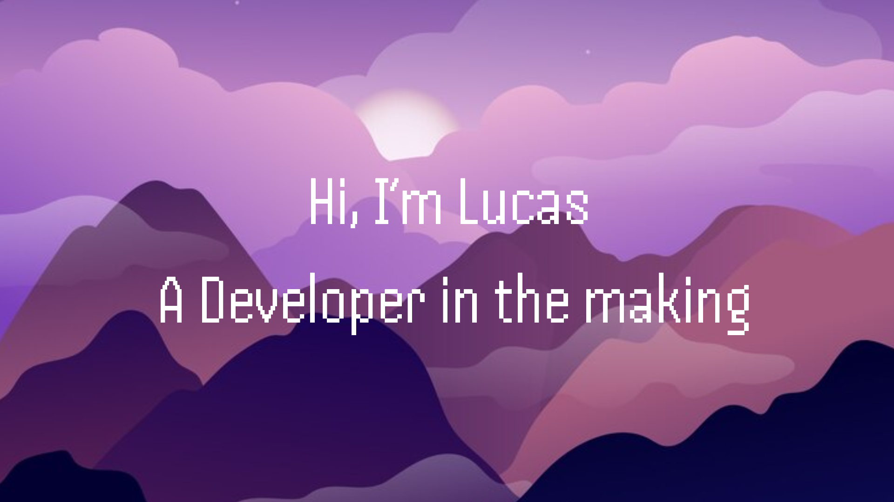

 [By FreePick](https://br.freepik.com)

### **(En)**

I’m a software developer in training with 7 months of experience and currently studying Computer Science at Universidade Veiga de Almeida. I’m excited to apply the knowledge I’ve gained to challenging projects and am always seeking new technologies to expand my skills. My journey in software development is just beginning, and I’m eager to grow in the field and contribute to innovations in the tech industry.

### **(Pt-br)** 

Sou um desenvolvedor de software em formação com 7 meses de experiência e atualmente estudo Ciência da Computação na Universidade Veiga de Almeida. Estou entusiasmado para aplicar os conhecimentos adquiridos em projetos desafiadores e continuo buscando novas tecnologias para expandir minhas habilidades. Minha trajetória no desenvolvimento de software está apenas começando, e estou ansioso para crescer na área e contribuir para inovações no setor de tecnologia. 
  

<h2 align="Center"> 🔥 Hard skills </h2> 

### 📝 Markup and Style Languages: 
  
### 👨‍💻 Programing language:
 

### 📚 Libraries and Frameworks:

### 🧰 Tools:

 
<h2 align="center"> GitHub Status </h2>

 

 

